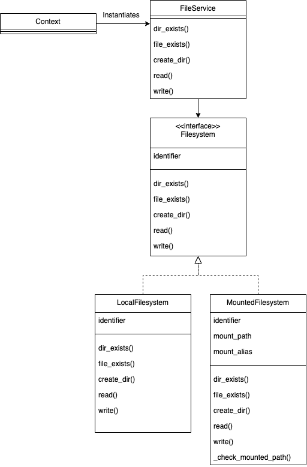

# File service

The file service is intented to provide an abstraction to filesystem read/writes allowing for the the implementation of interfaces to remote or mounted resources. The file service can be configured to interface with multiple `Filesystem` resources.

LUME-serices is packaged with `LocalFilesystem` and `MountedFilesystem` implementations, however, the `Filesystem` interface defined in `lume_services.services.files.filesystems.filesystem` can be used to implement any number of custom interfaces including remote cloud services.

## Filesystems

### LocalFilesystem

The local filesystem defined at [`lume_services.services.files.filesystems.local`](https://github.com/slaclab/lume-services/blob/main/lume_services/services/files/filesystems/local.py) uses the raw path provided to save and load methods for access to files.

### MountedFilesystem

The mounted filesystem interface defined at [`lume_services.services.files.filesystems.mounted`](https://github.com/slaclab/lume-services/blob/main/lume_services/services/files/filesystems/mounted.py) aims to provide a handler for filesystems or directories mounted to containerized services, as with Docker and Kubernetes. 

The handler checks the mount path for files and performs substring substitutions on full paths.

The mounted filesystem accommodates various mount types:

    # types associated with mounting host filesystem to kubernetes
    # https://kubernetes.io/docs/concepts/storage/volumes/#hostpath
    directory = "Directory"  # directory must exist at given path
    directory_or_create = (
        "DirectoryOrCreate"  # if directory does not exist, directory created
    )
    file = "File"  # file must exist at path
    file_or_create = "FileOrCreate"  # will create file if does not exist
    # socket = "Socket" # Unix socket must exist at given path
    # char_device = "CharDevice" # Character device must exist at given path
    # block_device = "BlockDevice" # block device must exist at given path
